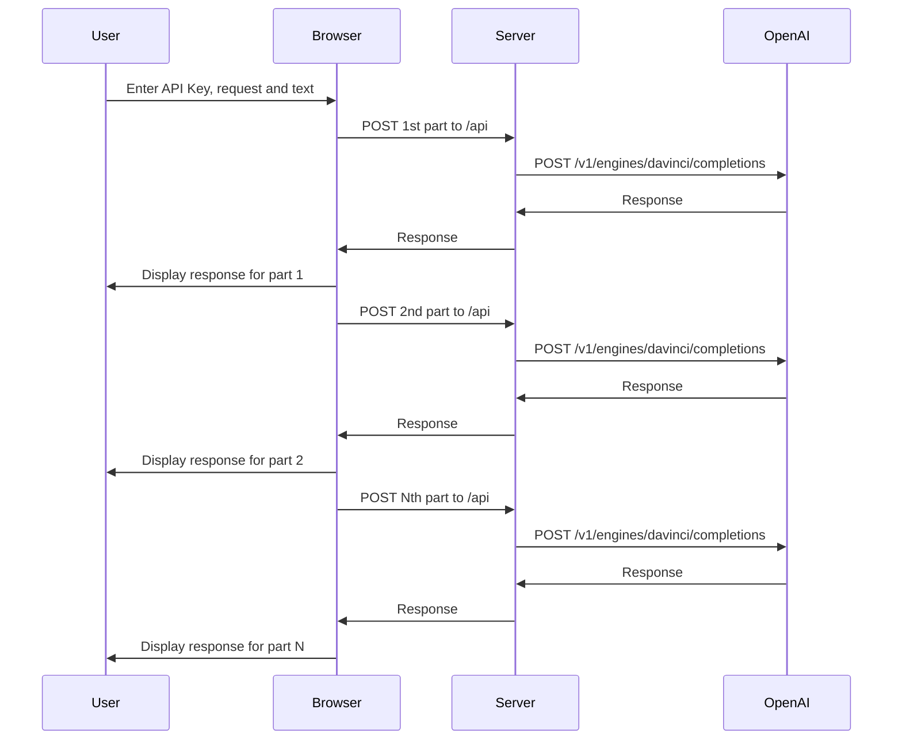

# SplitterBot
SplitterBot is a web application that allows users to split a large text into smaller parts and send each part along with a request to the OpenAI API. The application is built with Next.js and deployed on Vercel.

## Requirements
To use SplitterBot, you will need an OpenAI API key, which can be obtained at https://beta.openai.com/docs/api-reference/authentication.

## Usage
Enter your text and request into the provided fields.
Click the "Split Text" button to break up the text into smaller parts.
Click the "Send Requests" button to send each part of the text along with the request to the OpenAI API.
Your API key and request are stored in the browser's local storage, so there is no need to re-enter them if you revisit the page. Note that the API key is not stored on the server.

## Deployment
The SplitterBot application is deployed on Vercel at https://splitterbotGPT.vercel.app/.


## Sequence Diagram



## Getting Started

First, run the development server:

```bash
npm i

npm run dev
```
